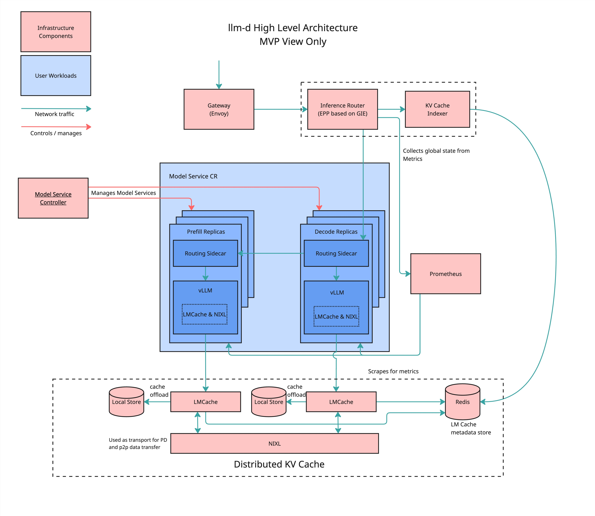

# Overview of llm-d architecture
**What is llm-d?**

llm-d is an open source project providing distributed inferencing for GenAI runtimes on any Kubernetes cluster. Its highly performant, scalable architecture helps reduce costs through a spectrum of hardware efficiency improvements. The project prioritizes ease of deployment+use as well as SRE needs + day 2 operations associated with running large GPU clusters.

It includes:

- Prefill/decode disaggregation
- KV Cache distribution, offloading and storage hierarchy
- AI-aware router with plug points for customizable scorers
- Operational telemetry for production, prometheus/grafana
- Kubernetes-based, works on OCP, minikube, and other k8s distributions
- NIXL inference transfer library

**llm-d consists of the following components:**

- Gateway API Inference Extension (GIE) - This extension upgrades an ext-proc-capable proxy or gateway - such as Envoy Gateway, kGateway, or the GKE Gateway - to become an inference gateway - supporting inference platform teams self-hosting large language models on Kubernetes. This integration makes it easy to expose and control access to your local OpenAI-compatible chat completion endpoints to other workloads on or off cluster, or to integrate your self-hosted models alongside model-as-a-service providers in a higher level AI Gateway like LiteLLM, Solo AI Gateway, or Apigee.
  The inference gateway:
  - Improves the tail latency and throughput of LLM completion requests against Kubernetes-hosted model servers using an extendable request scheduling algorithm that is kv-cache and request cost aware, avoiding evictions or queueing as load increases
  - Provides Kubernetes-native declarative APIs to route client model names to use-case specific LoRA adapters and control incremental rollout of new adapter versions, A/B traffic splitting, and safe blue-green base model and model server upgrades
  - Adds end to end observability around service objective attainment
  - Ensures operational guardrails between different client model names, allowing a platform team to safely serve many different GenAI workloads on the same pool of shared foundation model servers for higher utilization and fewer required accelerators

- Distributed KV Cache
  - LMCache (in llm-d container)
  - NIXL (in llm-d container)
  - KVCache Indexer
  - Redis

- Model Service Controller - ModelService is a Kubernetes operator (CRD + controller) that enables the creation of vllm pods and routing resources for a given model.
  - Enables disaggregated prefill
  - Supports creation of Gateway API Inference Extension resources for routing
  - Supports auto-scaling with HPA
  - Supports independent scaling of prefill and decode instances
  - Supports independent node affinities for prefill and decode instances
  - Supports model loading from OCI images, HuggingFace public and private registries, and PVCs

- Metrics Service (Prometheus)

### Architecture

